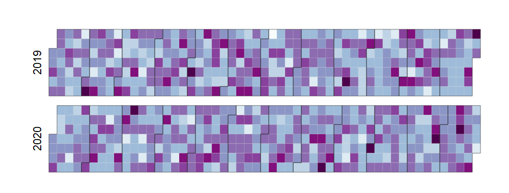
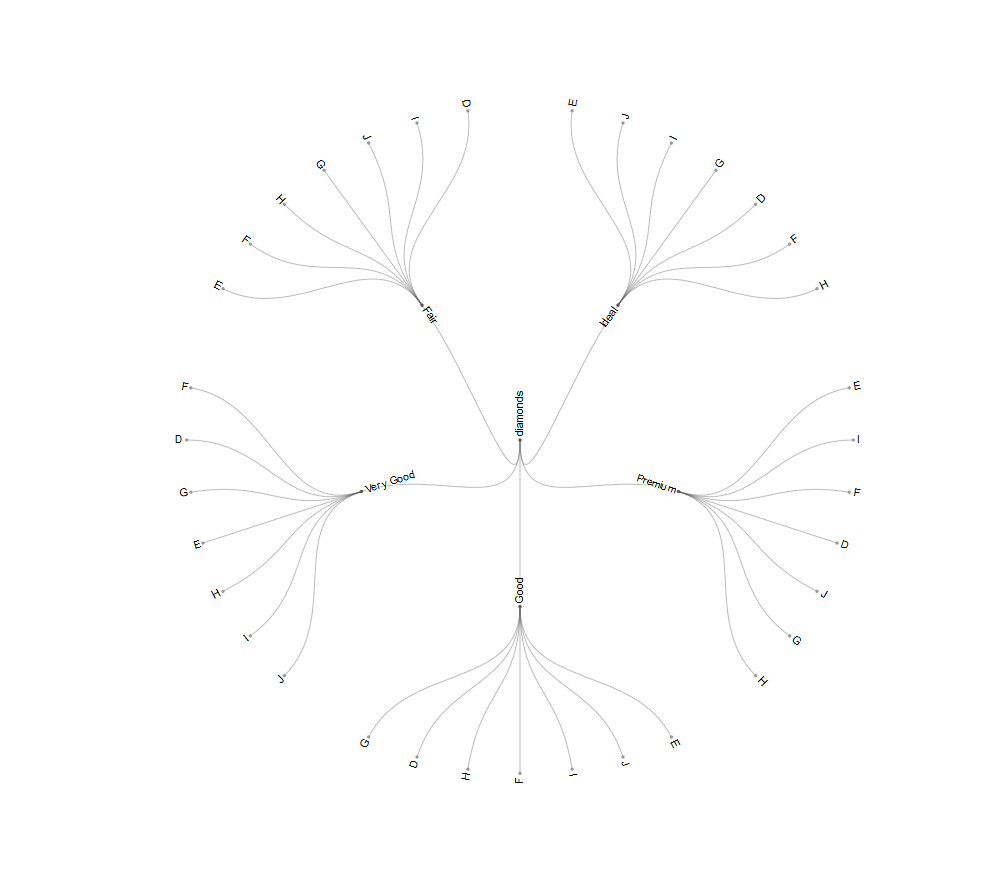

<!-- README.md is generated from README.Rmd. Please edit that file -->
r2d3wrappers
============

The goal of r2d3wrappers is to provide an easy interface to common D3 visuals.

Installation
------------

You can install this development package with

``` r
devtools::install_github("cwthom/r2d3wrappers")
```

Features
--------

Currently this package contains a wrapper for a calendar visual...

``` r

library(r2d3wrappers)
library(dplyr)

# create some random data, sampling dates between 2019-01-01 and 2020-12-31
dates <- as.Date(0:730, origin = "2019-01-01", format = "%Y-%m-%d")

# aggregate so one row per date
data <- data.frame(date = sample(dates, 10000, replace = TRUE)) %>% count(date)

# draw calendar
d3_calendar(data = data, date = date, value = n, 
            start = 2019, end = 2021, 
            showToday = FALSE, dateFormat = "%Y-%m-%d",
            colors = RColorBrewer::brewer.pal(9, "BuPu"),
            height = "300px")
```



A radialtree visual...

``` r

library(r2d3wrappers)
library(dplyr)

# read in some data
diamonds <- read.csv(system.file("datasets/diamonds.csv", package = "r2d3wrappers"),
                     stringsAsFactors = FALSE)

# process the data to a suitable form
diamonds_tree <- diamonds %>%
  select(cut, color) %>% 
  distinct() %>% 
  transmute(id = paste(cut, color, sep = ".")) %>% 
  bind_rows(diamonds %>% 
              select(id = cut) %>%
              distinct()) %>% 
  mutate(id = paste0("diamonds.", id)) %>% 
  bind_rows(tibble(id = "diamonds"))

# draw radialtree
d3_radialtree(data = diamonds_tree, height = "800px")
```


