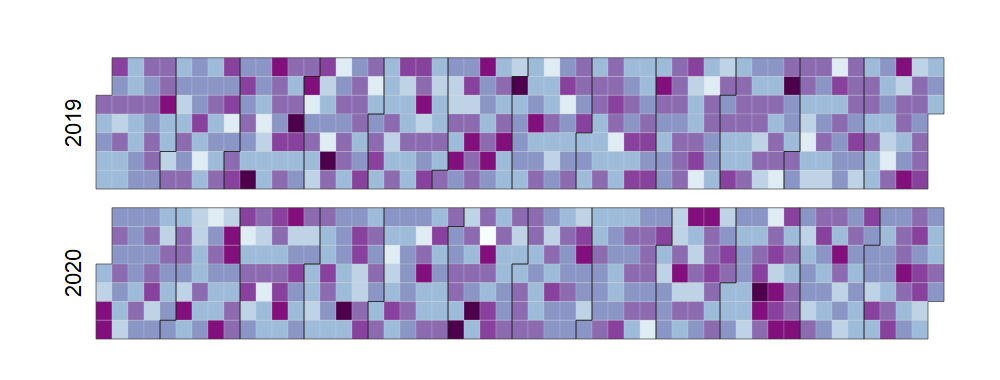

<!-- README.md is generated from README.Rmd. Please edit that file -->
r2d3wrappers
============

The goal of r2d3wrappers is to provide an easy interface to common D3 visuals.

Installation
------------

You can install this development package with

``` r
devtools::install_github("cwthom/r2d3wrappers")
```

Features
--------

Currently this package contains a wrapper for a calendar visual.

``` r

library(r2d3wrappers)
library(dplyr)

# create some random data, sampling dates between 01/01/2019 and 31/12/2020
dates <- as.Date(0:730, origin = "01/01/2019", format = "%d/%m/%Y") %>% 
  format("%d/%m/%Y") %>% as.character()

# aggregate so one row per date
data <- data.frame(date = sample(dates, 10000, replace = TRUE)) %>% count(date)

# draw calendar
d3_calendar(data = data, date = date, value = n, 
            start = 2019, end = 2021, showToday = FALSE,
            colors = RColorBrewer::brewer.pal(9, "BuPu"),
            height = "300px")
```


